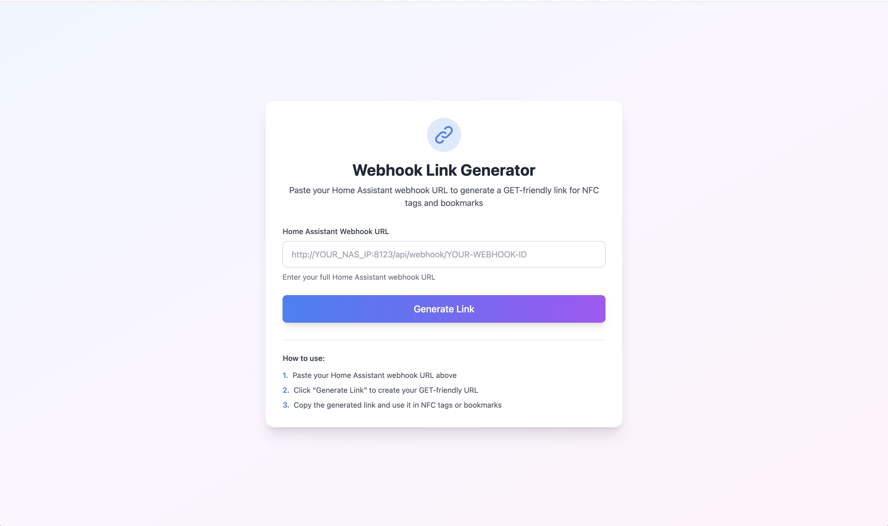
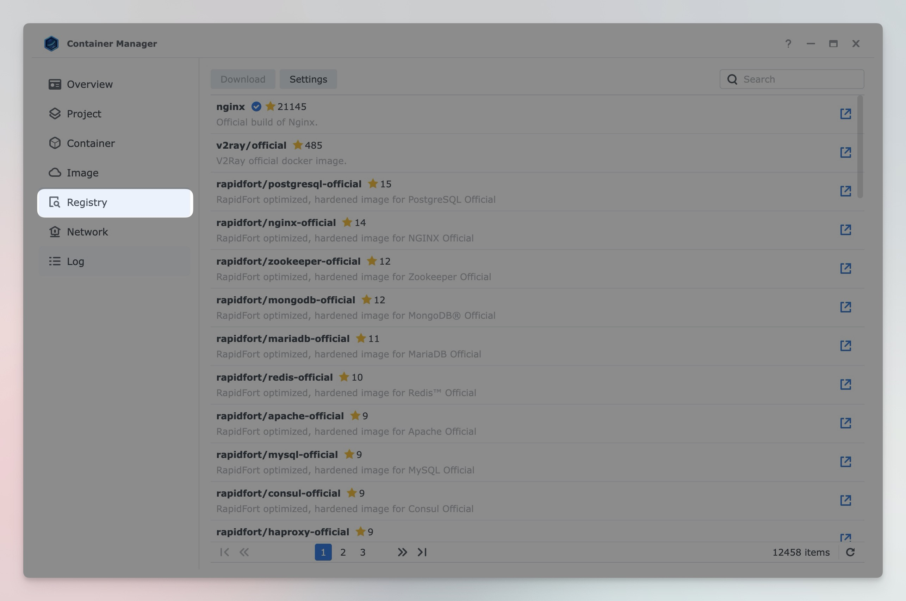
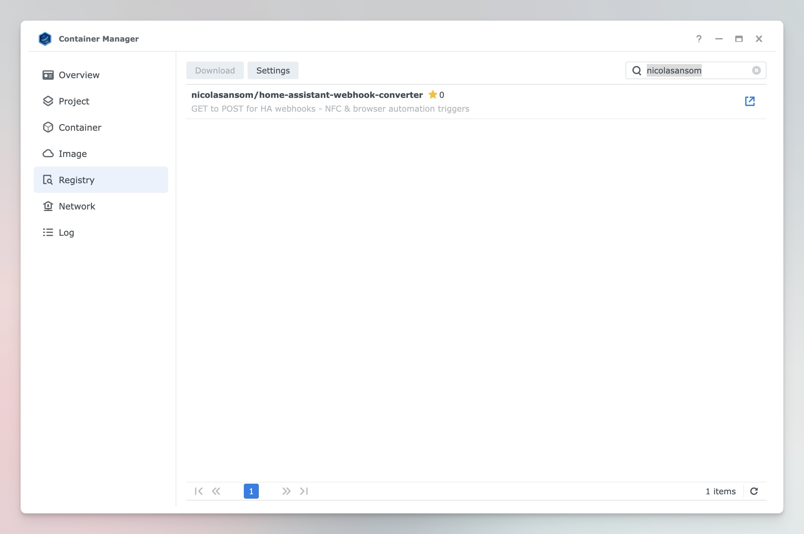
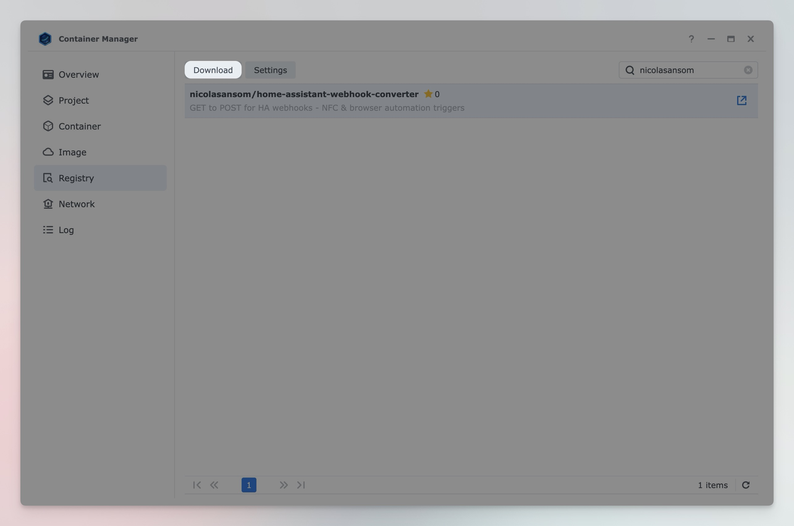
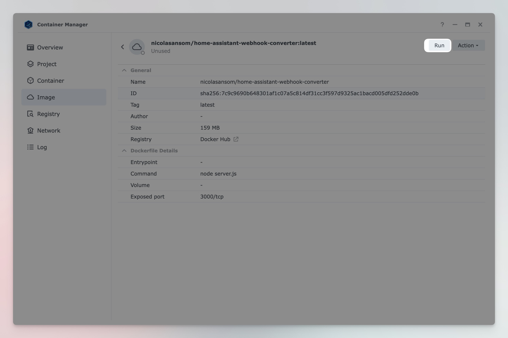
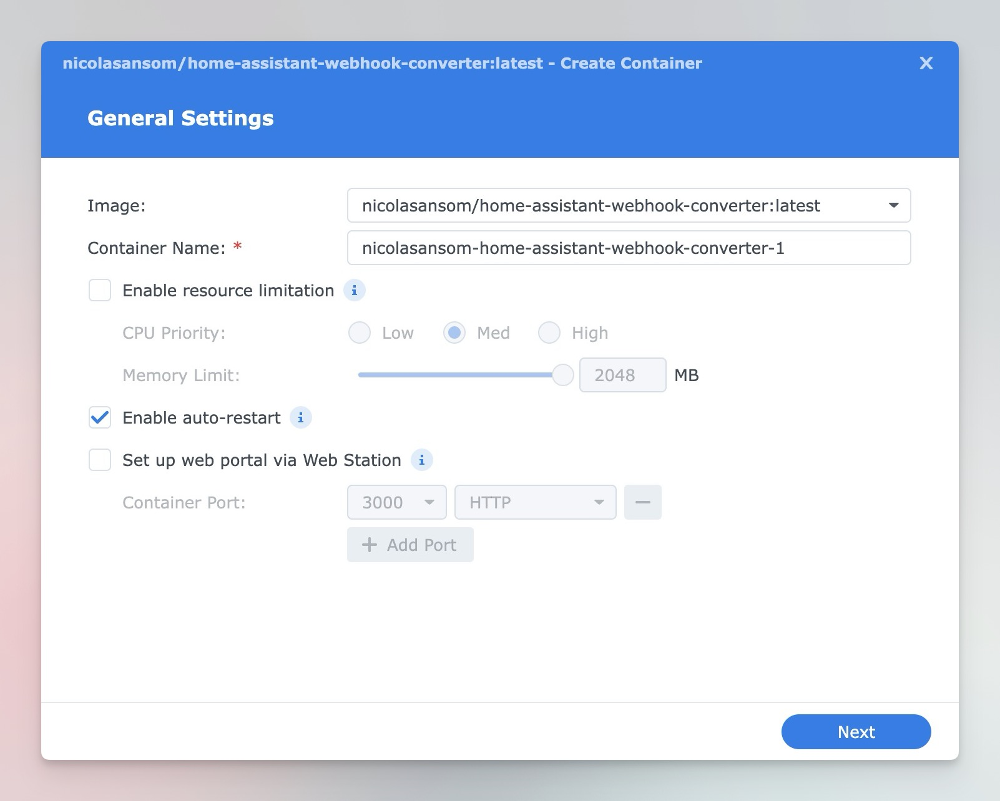
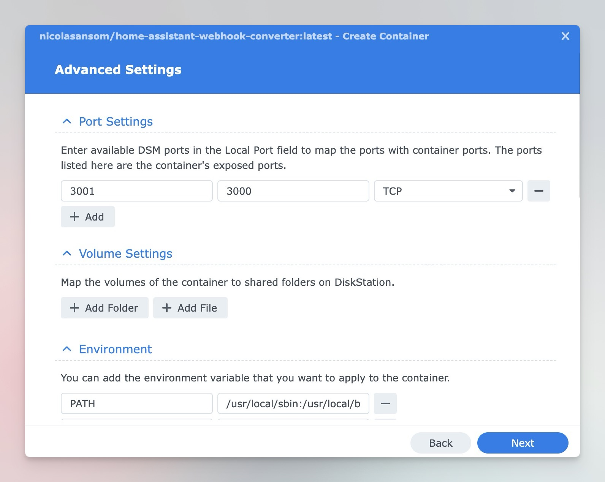
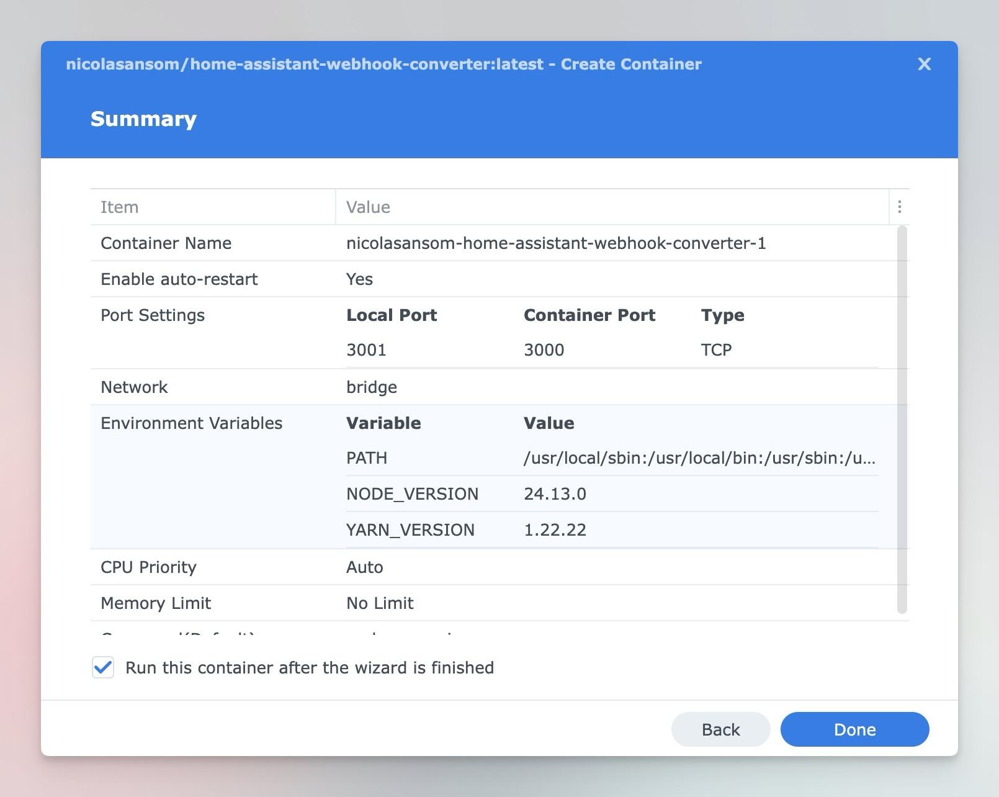
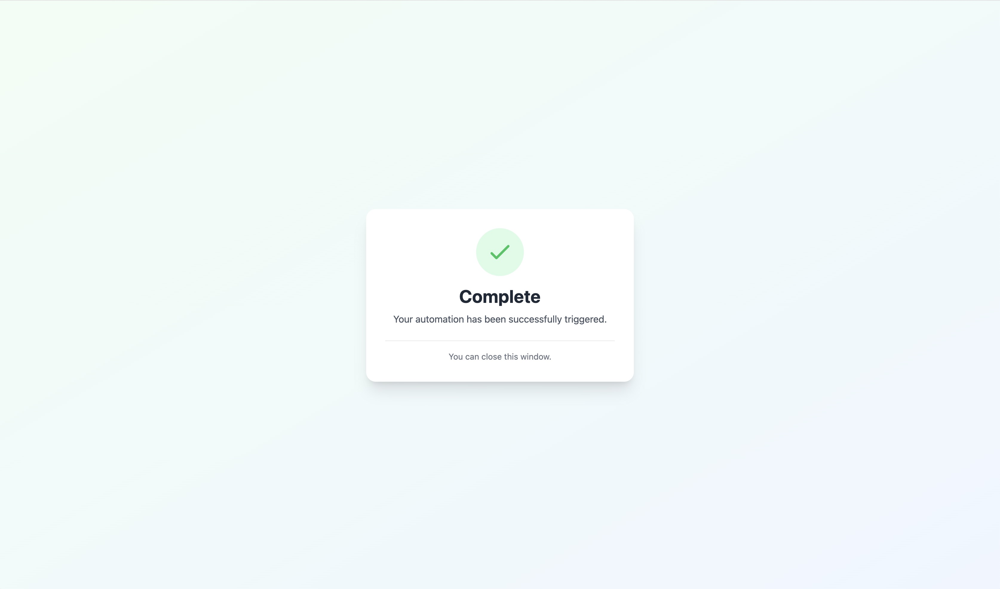

# Home Assistant Webhook Converter - GET to POST Server | Node.js Webhook Proxy

**Convert GET requests to POST for Home Assistant webhooks** - A lightweight Node.js server that enables NFC tags, browsers, and GET-only services to trigger Home Assistant automations. Perfect for Synology NAS Docker deployments.



**Features:**

- 🔗 **Link Generator Form** - Easy-to-use web interface to generate GET-friendly URLs
- 🔄 Converts GET requests to POST for Home Assistant webhooks
- 📱 Works with NFC tags, browsers, and GET-only services
- 🐳 Docker-ready for Synology Container Manager
- ⚡ Lightweight Node.js server
- 🎯 Simple setup, no configuration needed

## 🤔 Why This Exists

### The Problem

**Use Case:** You want guests to scan an NFC tag to trigger Home Assistant automations, or use browser bookmarks, IFTTT, or other services that only support GET requests.

**The Issue:**

- Home Assistant webhooks **only accept POST requests**
- NFC tags, browsers, and most simple services **send GET requests**
- This causes a **405 Method Not Allowed** error when trying to trigger Home Assistant webhooks directly

```
Browser/NFC Tag → GET request → Home Assistant Webhook
❌ 405 Error
```

### The Solution

This Node.js webhook converter server sits between the GET request and Home Assistant, automatically converting GET requests to POST requests:

```
Browser/NFC Tag → GET → Webhook Converter (Node.js) → POST → Home Assistant
✅ Works!
```

## 🚀 Setup Guide

### Container Manager (Recommended - Easiest)

This is the easiest way to get started using Synology's Container Manager to pull the pre-built Docker image.

#### Step 1: Open Container Manager

1. Open **DSM** → **Container Manager**


#### Step 2: Go to Registry Tab

1. Click the **Registry** tab at the top



#### Step 3: Search for the Image

1. In the search box, type: `nicolasansom`
2. Press Enter or click the search icon



#### Step 4: Download the Image

1. Find `nicolasansom/home-assistant-webhook-converter` in the results
2. Click on it to select it
3. Click the **Download** button
4. Select the **latest** tag (or specific version)
5. Click **OK** and wait for the download to complete



#### Step 5: Click into the Image and Run

1. In the Registry tab, find `nicolasansom/home-assistant-webhook-converter` in your downloaded images
2. Click on the image to open it
3. Click the **Run** button
4. A side form will open for configuration



#### Step 6: Configure Container

1. In the side form that opens:
   - **Container Name:** `webhook-converter`
   - **Enable auto-restart:** ✓ (recommended)
2. Click **Next** or continue to port settings



#### Step 7: Configure Port

1. In the side form, click **Port Settings** or navigate to the port configuration
2. Add port mapping:
   - **Container Port:** `3000`
   - **Local Port:** `3001` (or your preferred port)
3. Click **Next** or continue



#### Step 8: Review and Create

1. Review your settings in the side form
2. Click **Done**
3. Wait for the container to start



#### Step 9: Verify It's Running

1. In Container Manager, go to **Container** tab
2. Look for `-home-assistant-webhook-converter` with status **Running** 🟢

3. Open your browser and go to:

```
http://YOUR_NAS_IP:3001/health
```

Replace `YOUR_NAS_IP` with your Synology's IP address (e.g., `192.132.8.200`)

4. You should see something similar to this:

```json
{
  "status": "ok",
  "timestamp": "2026-01-04T21:21:27.173Z",
  "nodeVersion": "v24.12.0"
}
```

✅ **Success!** Your converter is running.


## 🔗 How to Use

1. Open your browser and navigate to:

```
http://YOUR_NAS_IP:3001/generate
```

Or simply visit the root URL:

```
http://YOUR_NAS_IP:3001/
```

2. Paste your Home Assistant webhook URL in the form
3. Click **Generate Link**
4. Copy the generated URL
5. Use this URL in NFC tags or bookmarks!

When you trigger the webhook, you'll see a success page:



## 🔒 Security Considerations

This service is designed for use within a secure network environment, typically behind your home network's firewall and router. It has no built-in authentication, which is intentional for ease of use in trusted local network scenarios.

**Best Practices:**

- 🏠 **Local Network Use**: Designed to run on your local network (192.168.x.x)
- 🔐 **Webhook IDs**: Keep your Home Assistant webhook IDs private
- 🛡️ **Network Security**: Your router's firewall typically provides the necessary protection for local services
