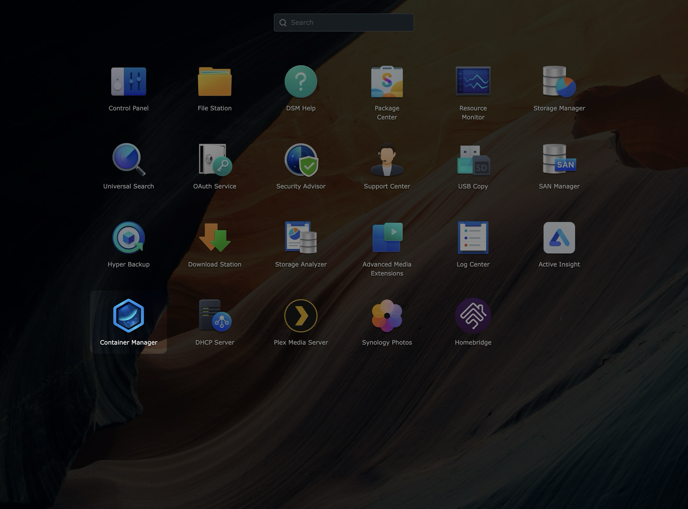
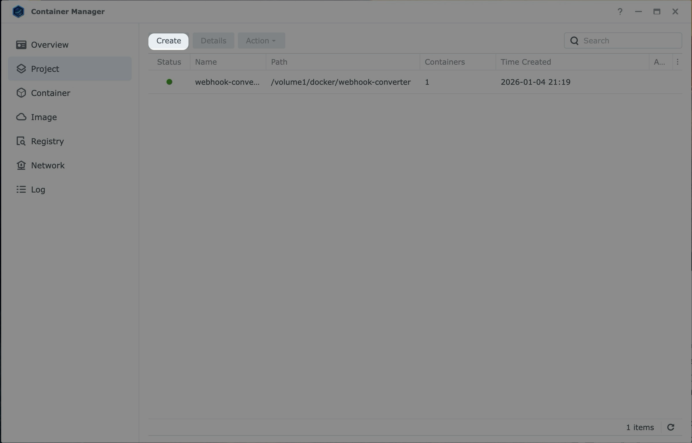
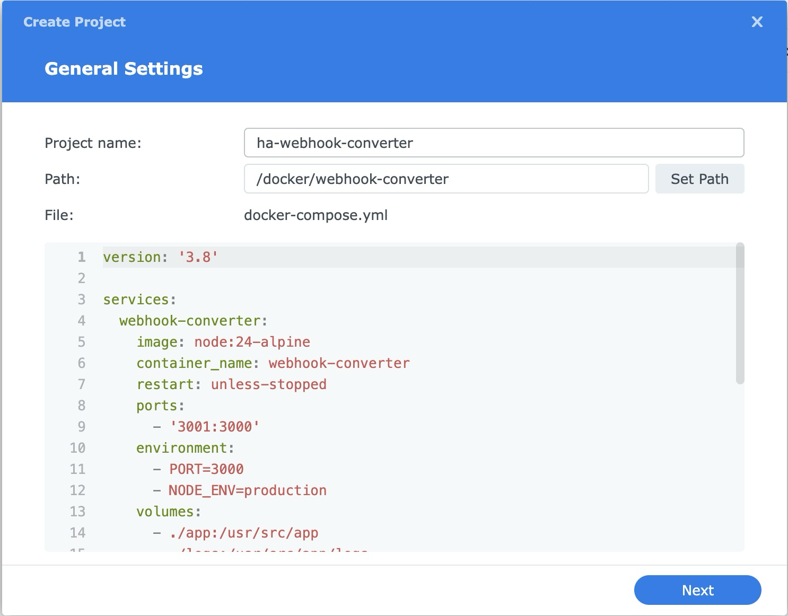
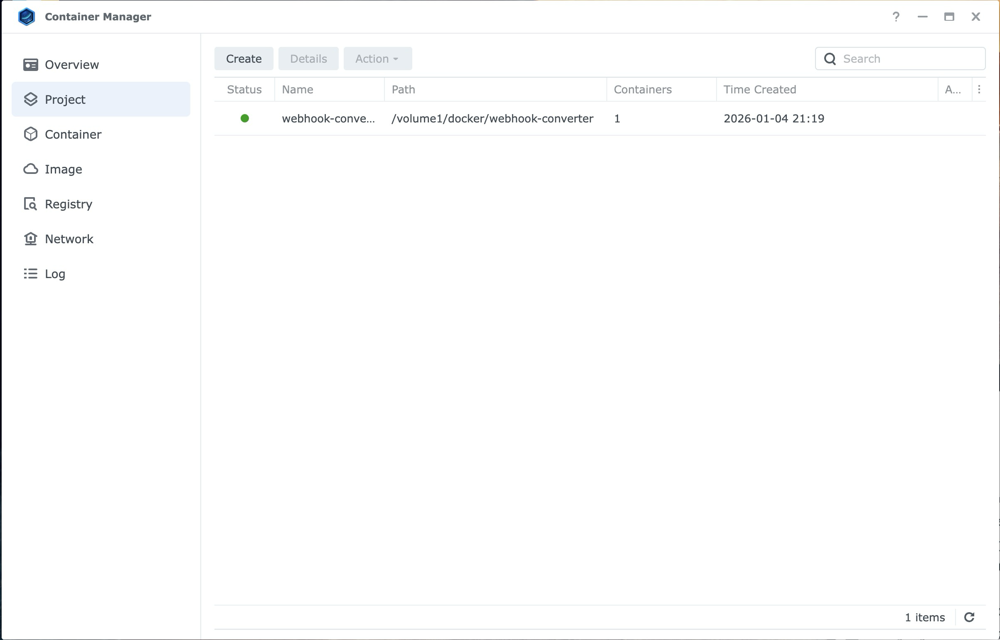

# Home Assistant Webhook Converter - GET to POST Server | Node.js Webhook Proxy

**Convert GET requests to POST for Home Assistant webhooks** - A lightweight Node.js server that enables NFC tags, browsers, and GET-only services to trigger Home Assistant automations. Perfect for Synology NAS Docker deployments.

**Features:**

- Converts GET requests to POST for Home Assistant webhooks
- Works with NFC tags, browsers, and GET-only services
- Lightweight Node.js server
- Docker-ready for Synology Container Manager
- Simple setup, no configuration needed

## 🤔 Why This Exists

### The Problem

**Use Case:** You want guests to scan an NFC tag to trigger Home Assistant automations, or use browser bookmarks, IFTTT, or other services that only support GET requests.

**The Issue:**

- Home Assistant webhooks **only accept POST requests**
- NFC tags, browsers, and most simple services **send GET requests**
- This causes a **405 Method Not Allowed** error when trying to trigger Home Assistant webhooks directly

```
Browser/NFC Tag → GET request → Home Assistant Webhook
❌ 405 Error
```

### The Solution

This Node.js webhook converter server sits between the GET request and Home Assistant, automatically converting GET requests to POST requests:

```
Browser/NFC Tag → GET → Webhook Converter (Node.js) → POST → Home Assistant
✅ Works!
```

## 🚀 Setup Guide

### Method 1: Pull from GitHub (Recommended)

**Step 1: Download from GitHub**

1. Open **File Station** on your Synology
2. Navigate to `/docker/` (create if doesn't exist)
3. **Option A - Direct Download:**

   - Download this repo as ZIP from GitHub
   - Extract to `/docker/webhook-converter/`

4. **Option B - Git Clone (if you have Git installed):**
   ```bash
   cd /volume1/docker
   git clone https://github.com/YOUR-USERNAME/home-assistant-webhook-converter.git webhook-converter
   ```

### Step 2: Create Project in Container Manager

1. Open **DSM** → **Container Manager**



2. Click the **Project** tab at the top

3. Click **Create** button



4. Fill in the form:
   - **Project Name:** `webhook-converter`
   - **Path:** Click browse → select `/docker/webhook-converter`
   - **Source:** Select **"Use an existing docker-compose.yml"**



5. Click **Done**

6. Wait for the container to build and start (~30 seconds)

### Step 3: Verify It's Running

1. In Container Manager, go to **Container** tab
2. Look for `webhook-converter` with status **Running** 🟢



3. Open your browser and go to:

```
http://YOUR_NAS_IP:3001/health
```

Replace `YOUR_NAS_IP` with your Synology's IP address (e.g., `192.168.1.100`)

4. You should see:

```json
{
  "status": "ok",
  "timestamp": "2026-01-04T21:21:27.173Z",
  "nodeVersion": "v24.12.0"
}
```

✅ **Success!** Your converter is running.

## 🔗 How to Use

### Step 1: Create Home Assistant Webhook

1. Open Home Assistant
2. Go to **Settings** → **Automations & Scenes**
3. Click **Create Automation** → **Create new automation**
4. Click **Add Trigger** → Select **Webhook**

5. Home Assistant generates a webhook URL like:

```
http://YOUR_NAS_IP:8123/api/webhook/WEBHOOK_ID
```

6. Copy this entire URL ← You'll need it!

### Step 2: Build Your Converter URL

Take your Home Assistant webhook URL and format it like this:

```
http://YOUR_NAS_IP:3001/convert?target=YOUR_WEBHOOK_URL
```

**Real Example:**

```
http://YOUR_NAS_IP:3001/convert?target=http://YOUR_NAS_IP:8123/api/webhook/WEBHOOK_ID
```

This is your final URL to use with NFC tags!

### Step 3: Write URL to NFC Tag

Use your converter URL to write to NFC tags. This enables any phone to scan the tag and trigger your Home Assistant automation without needing a special app.

## 🔒 Security Considerations

**Important Security Notes:**

- ⚠️ **No Authentication**: This service has no authentication by design - it's meant for local network use only
- 🔐 **Webhook IDs are Secret**: Your Home Assistant webhook IDs are sensitive - don't share them publicly
- 🏠 **Local Network Only**: This service should only be accessible on your local network (192.168.x.x)
- 🚫 **Don't Expose to Internet**: Never expose port 3001 to the internet without additional security (firewall, VPN, etc.)

## 🔧 Management

### View Logs

**Container Manager:**

1. Go to **Container** tab
2. Select `webhook-converter`
3. Click **Details** → **Log** tab

**File Station:**

- Navigate to `/docker/webhook-converter/logs/app.log`

---

### Restart Container

**Container Manager:**

- Select `webhook-converter` → **Action** → **Restart**

---

### Update Node.js Version

1. **Project** tab → Select `webhook-converter`
2. **Action** → **Edit**
3. Change image: `node:24-alpine` to `node:26-alpine`
4. Click **Build**

---
